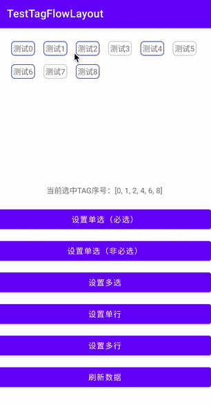

#### 简介

**这是一个Android流式布局，根据鸿翔大神之前写的[FlowLayout](https://github.com/hongyangAndroid/FlowLayout)设计思路结合`Material`库中的`ChipGroup`设计架构衍生而来**

#### 效果展示



#### 方法

##### setter

| 方法名称 | 作用 | 示例 |
| :----: | :----: | :----: |
| `setTagSpacingHorizontal(@Dimension tagSpacingHorizontal: Int)` | Tag间的水平间距 | `setTagSpacingHorizontal(24)` |
| `setTagSpacingVertical(@Dimension tagSpacingVertical: Int)` | Tag间的垂直间距 | `setTagSpacingVertical(24)` |
| `setSingleLine(singleLine: Boolean)` | 是否开启单行模式（默认false） | `setSingleLine(true)` |
| `setSingleSelection(singleSelection: Boolean)` | 是否开启单选模式（默认false） | `setSingleSelection(true)` |
| `setSelectionRequired(selectionRequired: Boolean)` | 是否为必选项（默认false | `setSelectionRequired(true)` |
| `setSelectMax(selectMax: Int)` | 最大选择数量（<=0为无效值 | `setSelectMax(10)` |
| `setOnTagClickListener(tagClickListener: TagClickListener)` | 设置Tag点击事件 | `setOnTagClickListener { view, position, parent -> }` |
| `setCheckedChangedListener(checkedChangedListener: CheckedChangedListener)` | 设置Tag状态变更监听事件 | `setCheckedChangedListener { group, checkedIds -> }` |

##### getter

| 方法名称 | 作用 | 返回类型 |
| :----: | :----: | :----: |
| `isSelectMax()` | 是否达到最大的选择数量 | `Boolean` |
| `clearCheck()` | 清除所有选中数据 | `void` |
| `getCheckedTagOrder()` | 获取选中单选下标 | `Int` |
| `getCheckedTagOrders()` | 获取选中集合下标组 | `List<Int>` |

#### Attributes属性

| 属性名称 | 作用 | 示例 |
| :----: | :----: | :----: |
| `app:tagSpacing` | Tag间的间距 | `app:tagSpacing="24dp"` |
| `app:tagSpacingHorizontal` | Tag间的水平间距 | `app:tagSpacingHorizontal="24dp"` |
| `app:tagSpacingVertical` | Tag间的垂直间距  | `app:tagSpacingVertical="24dp"`|
|`app:singleLine`|是否开启单行模式（默认false）|`app:singleLine="true"`|
|`app:singleSelection`|是否开启单选模式（默认false）|`app:是否开启单选模式="true"`|
|`app:selectionRequired`|是否为必选项（默认false）|`app:selectionRequired="true"`|
|`app:selectMax`|最大选择数量（<=0为无效值）|`app:selectMax="10"`|

#### 用法
```
dependencies {
    implementation 'io.github.smallmarker:tagflowlayout:0.0.1'
}
```
#### 声明
```
<com.smallmarker.tagflowlayout.TagFlowLayout
            android:id="@+id/tag_flow_layout"
            android:layout_width="match_parent"
            android:layout_height="wrap_content"
            app:tagSpacing="16dp"/>
```
#### Adapter

##### 方法属性

* 创建Adapter：`TagFlowAdapter.create(dataList)`
* 设置Tag：`setView(parent: TagFlowLayout, position: Int, t: T)`
* 设置Tag状态：`setChecked(position: Int, t: T)`
* 监听状态变化：`setCheckedChanged(isChecked: Boolean, position: Int, view: View)`


##### 使用步骤
```
// 添加数据
dataList.addAll(generateList())
// 设置Adapter
tagFlowLayout.adapter = TagFlowAdapter.create(dataList) {
// 设置tag
setView { parent, position, t ->
   TextView(parent.context).apply {
       text = t
       setBackgroundResource(R.drawable.bg_tag_selector)
       setPadding(10, 10, 10, 10)
       }
    }
// 设置tag状态
setChecked { position, t ->
   position % 2 == 0
}
// 状态监听
setCheckedChanged { isChecked, position, view ->
   Log.d("TAG", "当前TAG状态：${isChecked}, ${position}")
  }
}
```


